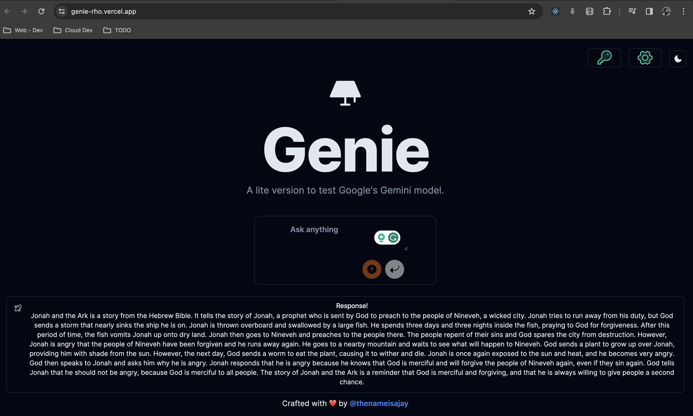

# GENIE

## Deployment

The app is currently deployed on Vercel: genie-gemini.vercel.app/

## Features:

-   Text Generation: Generate text from both text input and images.
-   Model Selection: Automatically switches between Gemini Pro and Gemini Pro Vision models for optimal results.
-   API Key Testing: Verify the functionality of your Gemini API key.

## Availability and Models:

Available Regions: Check out the available regions list at https://ai.google.dev/available_regions

Supported Models:

-   Gemini Pro
-   Gemini Pro Vision

Note: Please keep in mind that performance optimization for the UK region is planned for future availability.

## Description

This web application makes use of the Google Gemini API to generate text from both text-based and image-based inputs. It was originally intended for testing the GPT-4-Vision model, but upon its release, it underwent codebase adaptation to integrate the Gemini API. The application was used as an internal testing platform for the Gemini API within our organization and is no longer in use.

## Tech Stack

-   Typescript
-   NextJS
-   TailwindCSS 3.4
-   Gemini API

## RUN LOCALLY

<ul>
<li>Clone the repo</li>
<li>Install dependencies</li>
<li> Insert your API key in the .env file as shown in the .env example</li>
<li>Run the app using <code> npm run dev</code></li>
</ul>

## Documentation for Development

Refer to Learn.md for detailed development documentation.

## Screenshots

## Contributing

Welcome to the GENIE project! We're excited to have you join our project.

Here's a quick guide to contributing:

-   Fork the repository: Start by creating a fork of the project on GitHub.
-   Clone your fork: Clone your forked repository to your local machine.
-   Create a new branch: Make your changes on a new branch to keep things organized.
-   Follow code style: Adhere to the project's code style guidelines.
-   Write tests: Ensure your changes are covered by tests to maintain quality.
-   Submit a pull request: When you're ready, create a pull request from your branch to the main repository.
-   Address feedback: Engage in discussions and incorporate any feedback from reviewers to improve your contribution.

## License

This project is licensed under the MIT License. See the LICENSE file for details.
